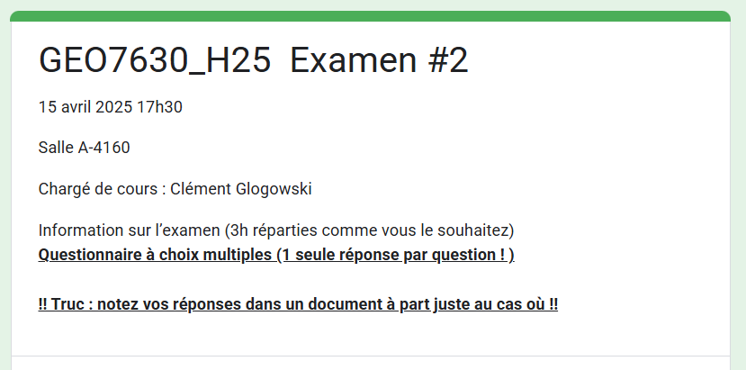
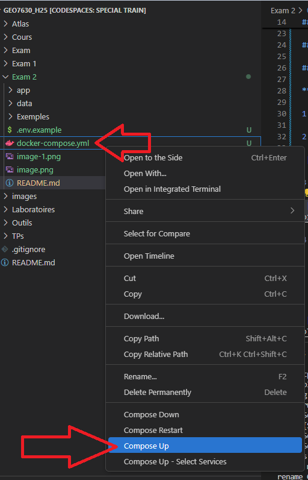
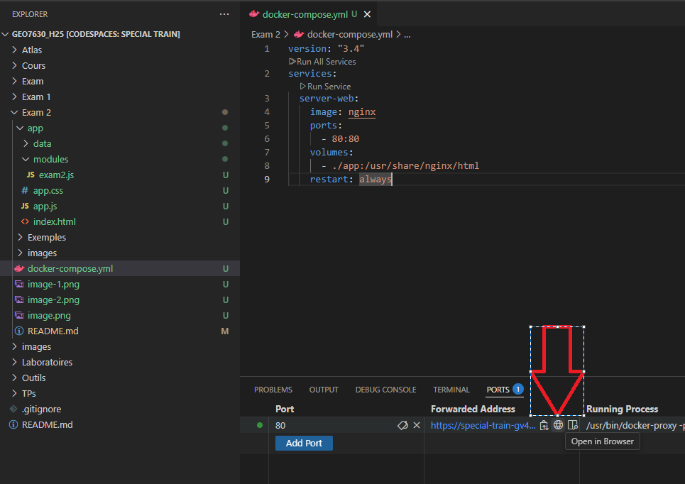
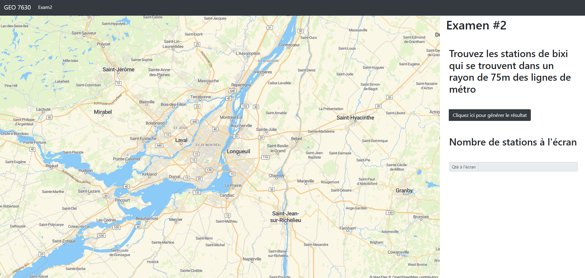
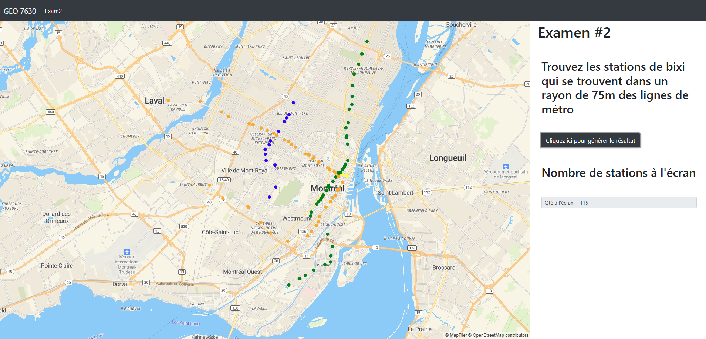

GEO7630H25 - EXAM #2

15 avril 2024 17h30 

Salle A-4160

Chargé de cours : Clément Glogowski

## Information sur l’examen

3h réparties comme vous le souhaitez

## Première partie

Questionnaire à choix multiples **(1 seule réponse par question ! )**

Répondre aux questions directement dans le fichier **GOOGLE FORM** ci-joint : 

[GEO7630H25 - EXAM #2](https://forms.gle/7oDSYR54hVBgNgAUA)

## Deuxième partie 

### Rédaction technique d’un module cartographique javascript

**Pré-requis :** 

1. Ouvrir github : <https://github.com/Captain-Oski/GEO7630_H25>

2. Lancer Codespace sur la branche main 

3. Démarrer le docker-compose

4. Vérifier que l’application fonctionne correctement en allant sur la page. 

   1. Attention il se peut que vous ayez à changer le début de l’url avec votre propre url de codespace

   2. [https://**solid-robot-66qj67v4535v7g**-8000.app.github.dev/exam2/app/#9/45.55/-73.55](https://solid-robot-66qj67v4535v7g-8000.app.github.dev/exam2/app/#9/45.55/-73.55)

Lorsque vous éditez les fichiers **./modules/exam2.js** et **./app.js** les changements se répercutent automatiquement il suffit de **recharger** la page web de l’application. 

Vous pouvez compléter les trous dans l’ordre suggéré :

1\. Créer un buffer (turf.buffer) de 75m autour des lignes de métro (ligne\_metro.js)

2\. Trouver un set de point (stations\_bixi.js) qui tombe dans ce buffer (turf.pointwithin)

3\. Collecter (turf.collect) la propriété ‘route\_name’

4\. Ajouter une source et un layer à partir de la couche de points qui tombent dans le rayon de 75m

5\. Colorier les points en fonction de leur ligne

6\. Ajouter popup sur le nom de la propriété ‘route\_name’

7\. Lorsque je clique sur le bouton ma couche s’ajoute à la carte

8\. Lorsque je clique sur le point mon popup me montre la valeur de la propriété

9\. **Bonus** : montrer le nombre de station à l’écran dynamiquement

## Résultat final attendu lorsqu’on clique sur le bouton

- Les stations de bixi qui se trouvent dans un rayon de 75m d’une station de métro

- La couleur des stations en fonction de la ligne la plus proche

- Un popup qui indique la couleur de la ligne quand on clique dessus

- Le nombre de stations qui s’affichent à l’écran

